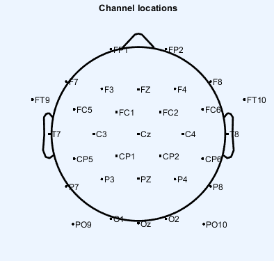
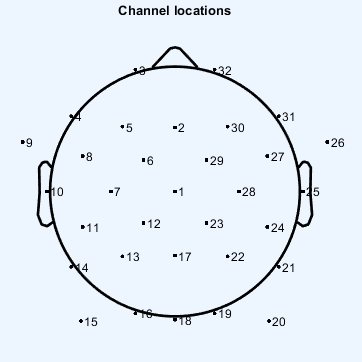

## EEG preprocessing and analysis pipeline:

1. After exporting EDF files from Emotiv, the first step is curating the EDFs using the edf_file_curation.m

- Add information of eeg data folder to subject_data_info.xlsx

2. Preprocessing: a semi-automatic procedure

- Open EEGLAB and load curated dataset

- View Channel data (scroll) and Channel spectra to inspect the raw EEG

- Apply 1Hz high-pass filter

- Inspect Channel data and visually detect bad channels 
(Exlusion criteria for bad channel removal: channels with sudden shifts, excessive high-frequency noise, and voltage amplitude exceeding 100mV)
Add channel numbers to subject_data_info.xlsx

- Run preprocessing_AO.m to perform preprocessing for AO EEG datasets. Do the same for AOE dataset using preprocessing AOE.m

- Open EEGLAB again and load preprocessed datasets. Revisit Channel data (scroll) to inspect epochs

- Visually detect channels and epochs that remain impaired and add the channel/epoch numbers to subject_data_info.xlsx 
(Exclusion criteria for bad epoch removal: having more than 2 bad channels)

- Run preprocessing script 1 last time.

3. Run explore_AO_ersp.m and explore_AOE_ersp.m to explore the time-frequency analyses and ERSPs

## Mapping channel labels and numbers of 32-electrode system
Channel labels | numbers
--- | ---
'Cz' | 1
'FZ' | 2
'FP1' | 3
'F7' | 4
'F3' | 5
'FC1' | 6
'C3' | 7
'FC5' | 8
'FT9' | 9
'T7' | 10
'CP5' | 11
'CP1' | 12
'P3' | 13
'P7' | 14
'PO9' | 15
'O1' | 16
'PZ' | 17
'Oz' | 18
'O2' | 19
'PO10' | 20
'P8' | 21
'P4' | 22
'CP2' | 23
'CP6' | 24
'T8' | 25
'FT10' | 26
'FC6' | 27
'C4' | 28
'FC2' | 29 
'F4'| 30
'F8' | 31
'FP2' | 32

